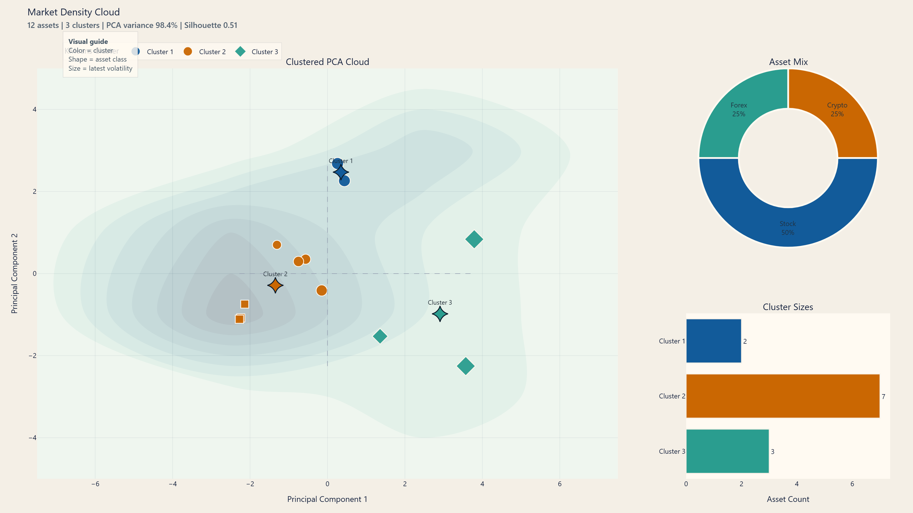

# Market Density Cloud

Interactive PCA dashboard for a mixed basket of stocks, crypto, and forex symbols. The project downloads market data with `yfinance`, builds return and volatility features, projects them into two PCA components, clusters the result with KMeans, and exports both an interactive dashboard and a repo-ready preview image.



## Project layout

```text
.
|-- assets
|   `-- dashboard-preview.png
|-- market_density
|   |-- __init__.py
|   |-- __main__.py
|   |-- analysis.py
|   |-- backtest.py
|   |-- cli.py
|   |-- dashboard.py
|   |-- data.py
|   `-- signals.py
|-- output
|   |-- backtest_returns.csv
|   |-- backtest_summary.csv
|   |-- dashboard.html
|   |-- features.csv
|   |-- pca_clusters.csv
|   `-- signals.csv
|-- .gitignore
|-- README.md
`-- requirements.txt
```

## What it does

1. Downloads adjusted close data for stocks, crypto, and forex symbols.
2. Builds per-symbol return and volatility features.
3. Reduces those features to two PCA components.
4. Applies KMeans clustering to the PCA coordinates.
5. Derives cross-sectional long/short signals from the PCA cluster structure.
6. Runs an out-of-sample train/test backtest on the signal weights.
7. Exports a polished Plotly dashboard and a static PNG preview for GitHub.

The feature pipeline is interval-aware, so annualization adjusts correctly for runs like `--interval 1wk` or `--interval 1mo`.

## Supported symbol formats

- Stocks: `AAPL`, `MSFT`, `NVDA`
- Crypto: `BTC-USD`, `ETH-USD`, `SOL-USD`
- Forex: `EURUSD=X`, `GBPUSD=X`, `JPY=X`

If you run the project without symbols, it uses a default mixed basket.

## Setup

```bash
python -m venv .venv
.venv\Scripts\activate
pip install -r requirements.txt
```

## Usage

Run the default basket:

```bash
python -m market_density
```

Run a custom mixed basket:

```bash
python -m market_density AAPL MSFT BTC-USD ETH-USD EURUSD=X GBPUSD=X
```

Use explicit asset groups:

```bash
python -m market_density --stocks AAPL MSFT NVDA --crypto BTC-USD ETH-USD --forex EURUSD=X GBPUSD=X
```

Example with custom clustering and output settings:

```bash
python -m market_density --stocks AAPL MSFT --crypto BTC-USD --forex EURUSD=X --period 2y --window 30 --clusters 4 --output-dir output
```

Change the backtest window or include trading costs:

```bash
python -m market_density --backtest-window 90 --transaction-cost-bps 5
```

Skip PNG preview export:

```bash
python -m market_density --skip-preview
```

## Outputs

- `output/features.csv`: feature table with asset metadata
- `output/pca_clusters.csv`: PCA coordinates, cluster labels, and hover metrics
- `output/signals.csv`: current snapshot signals and position weights
- `output/backtest_returns.csv`: strategy, benchmark, equity curve, and drawdown series
- `output/backtest_summary.csv`: train/test dates and backtest performance metrics
- `output/dashboard.html`: interactive Plotly dashboard
- `assets/dashboard-preview.png`: static preview image for the repository

## Notes

- Stocks and forex are annualized on 252 trading days.
- Crypto is annualized on 365 days.
- Weekly and monthly downloads use interval-adjusted annualization instead of daily factors.
- Marker color represents cluster, marker shape represents asset class, and marker size represents latest volatility.
- Signal weights are inverse-volatility weighted inside the most bullish and most bearish PCA clusters.
- The backtest uses a train/test split so the reported performance comes from out-of-sample returns rather than the same sample used to fit the PCA snapshot.
- `output/` is ignored by git; the PNG preview under `assets/` is the repository-friendly artifact.
- If Chrome or Chromium is unavailable, the HTML dashboard is still written and preview export is skipped without failing the run.
